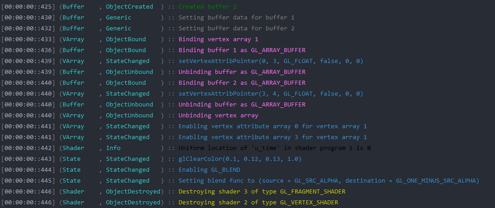
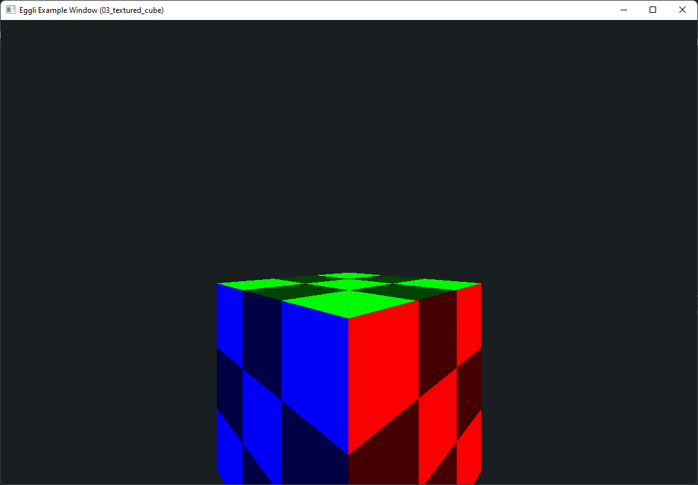

<h1 align="center">
  eggli
</h1>

<p align="center">
  <a href="https://jitpack.io/#exerro/eggli"></a>
</p>

Eggli is a lightweight wrapper around OpenGL, aiming to make graphics a bit
nicer and a bit more Kotlin-like.

### Utility functions

The package `me.exerro.eggli.util` contains a whole load of functionality which
builds on top of the rest of the library. It can be used as reference when
implementing similar functionality, or used to simplify common tasks. For
example, there's a method to produce a cube mesh complete with UVs and per-face
colours, as well as a helper that simplifies shader compilation.

### Debugging contexts

Pretty much all the library functions accept a `GLDebugger.Context`, this allows
special log messages to be recorded to aid debugging. The logging system
has different kinds of log messages to help find particular kinds of actions.



Particular kinds of messages can be ignored, allowing you to narrow down
particular problems and get relevant log messages.

### GL contexts

OpenGL is single threaded. To avoid various related multithreading issues, Eggli
exposes a `GLWorker` interface which lets work be submitted to run on a
dedicated OpenGL thread. Values that should be evaluated on this thread can be
wrapped in a `GL` instance, e.g. `GL<Int>`. All the Eggli functions which call
OpenGL require a `GLContext` in scope, which is provided by `GLWorker`.
`GLWorker` also lets you `evaluate` `GL<T>`s to get values back from the OpenGL
thread.

### Enum narrowing

The LWJGL bindings, as well as the OpenGL spec, use a mysterious `GLenum` type
all over the place. This means you can pass in `GL_RED` to something expecting
a framebuffer name. Eggli uses a code generator to create objects for each enum
member that inherit from each interface it belongs to, for example `GL_RED` is
both a `GLTextureImageFormat` and a`GLTextureParameterSwizzleValue`. This helps
avoid runtime errors from passing in invalid values, and also helps
experimentation and discovery - you can see what your IDE suggests from
`GLTextureImageFormat.___`.

### Lifetimes for object allocation

In OpenGL, objects are explicitly allocated and destroyed. In Eggli, objects are
allocated within a `Lifetime`, which automatically frees the objects when ended.
The [lifetime library](https://github.com/exerro/lifetimes-kt) offers a lot of
functionality which I won't go into here, but this feature allows you to worry
less about passing around handles to be destroyed later and focus on the code
you want to write.

Objects allocated are wrapped in a `GLResource<T>` which lets you safely access
the value within (ensuring it's not been destroyed) and explicitly destroy it if
required.

## Repository structure

* `eggli` - library source code
* `eggli-gen` - code generator to write GLenum content
* `eggli-examples` - example code

### Examples

Please use the
[examples](https://github.com/exerro/eggli/tree/main/eggli-examples/src/main/kotlin)
as a reference for how to do things, both with Eggli and  just in general with
OpenGL.



## Installation

Check out the [releases](https://github.com/exerro/eggli/releases), or
using a build system...

> Note you'll also [need LWJGL to run](#installing-lwjgl), as well as
> [lifetimes-kt](https://github.com/exerro/lifetimes-kt)

### Gradle (`build.gradle.kts`)

```kotlin
repositories {
    // ...
    maven { url = uri("https://jitpack.io") }
}

dependencies {
    // implementation("me.exerro:eggli:0.1.0")
    // while in development, use this instead:
    implementation("me.exerro:eggli:main-SNAPSHOT")
}
```

### Maven

```xml
<repositories>
  <repository>
    <id>jitpack.io</id>
    <url>https://jitpack.io</url>
  </repository>
</repositories>

<dependency>
  <groupId>me.exerro</groupId>
  <artifactId>eggli</artifactId>
  <!--<version>0.1.0</version>-->
  // while in development, use this instead:
  <!--<version>main-SNAPSHOT</version>-->
</dependency>
```

## Installing LWJGL

To use Eggli in your projects, you'll need LWJGL. Check out
[lwjgl.org/customize](https://www.lwjgl.org/customize) for instructions, and/or
look at the `eggli-examples/build.gradle.kts` file to see a working example
(specifically the `[LWJGL]` commented sections.)

TODO: VM option `-javaagent:lib/lwjglx-debug-1.0.0.jar` seems to do debugging
stuff

## Testing the build before release

    ./gradlew clean && ./gradlew build && ./gradlew build publishToMavenLocal
